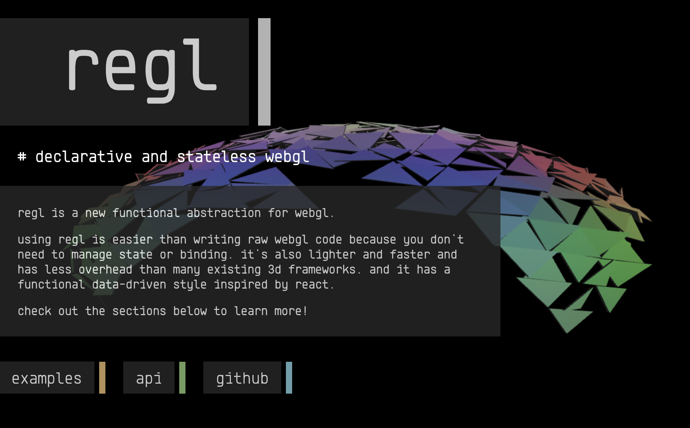

# example-regl [website](krist7599555.github.io/example-regl/)

sample to use `regl` in many way

| name      | dedscription                           |
| --------- | -------------------------------------- |
| example-1 | light with .dds material               |
| example-2 | monalisa with manupulate specific area |
| example-2 | stream camera to texture               |

## Resource

- [http://regl.party](http://regl.party)
  
- [https://github.com/regl-project/regl/blob/master/API.md](https://github.com/regl-project/regl/blob/master/API.md)
